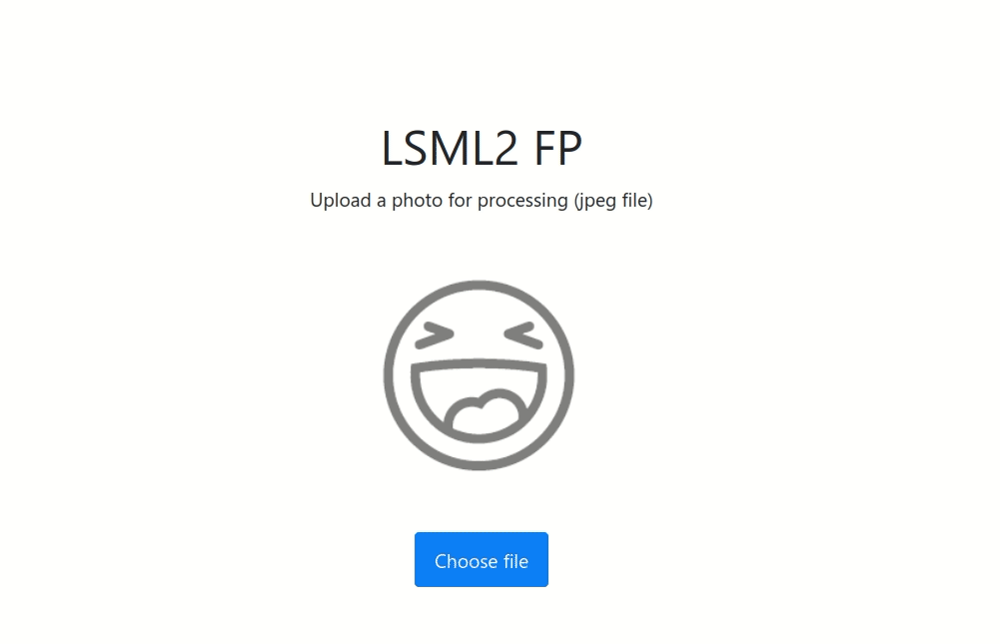

# hse-mds-lsml2-fp

Final Project for the LSML2 course.

## Goal

This project is a prototype of ML-service. The user uploads a jpeg image via a nice ajax form and gets an upscaled (higher-resolution) version of it. The webapp workds asynchronously, with background conversion status tracking and a processing indicator.



The model is a [Single Image Super-Resolution Network](https://arxiv.org/pdf/1609.04802.pdf), which was trained adverserially (GAN) on a [DIV2K](https://data.vision.ee.ethz.ch/cvl/DIV2K/) dataset.

## Project structure

The app is composed of Redis (the broker and backend for Celery), a Celery worker, and the Flask app.

The app is splitted into lightweight frontnend part, which is providing API, and a heavy backend part for model inference. Those two parts do not share any code, making them easy to deploy and scale =)

``` txt
.
├── backend        <- Celery worker
├── frontend
│   ├── app        <- Flask API
│   └── www        <- Web root, pure-JS webapp (static files served with Nginx)
├── site-data      <- Persistent storage for uploaded/transformed files
└── train          <- Training files
```

For better scalability, the frontend is located behind the Nginx server.

To reduce a size of backend containers (torch, numpy) the multistage bugild procedure was developed.

We are using a ready-made Flower image as a Celery dashboard.

## How to Run

``` sh
    docker-compose up --build
```

Open http://localhost:8000 in your browser.

## Model Training

The model was trained from scratch as GAN with, L2_loss (see `train` folder).

## TODO

* During inference group Celery tasks and feed the model with batches of images instead of a single image at once (for super-highload scenario).
* Train the model with celebrities dataset.

<!-- ## Nice examples
 * [Handling ML Predictions in a Flask App](https://github.com/a-poor/flask-celery-ml/) -->